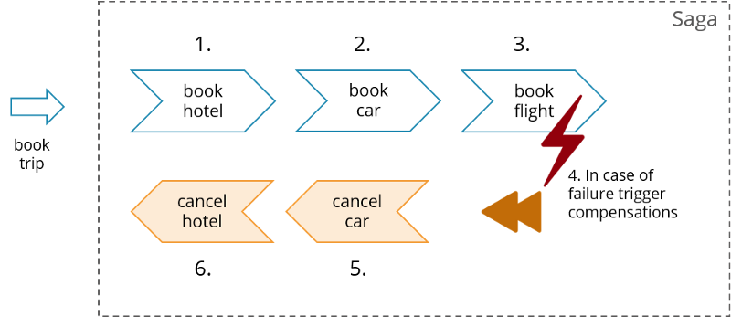
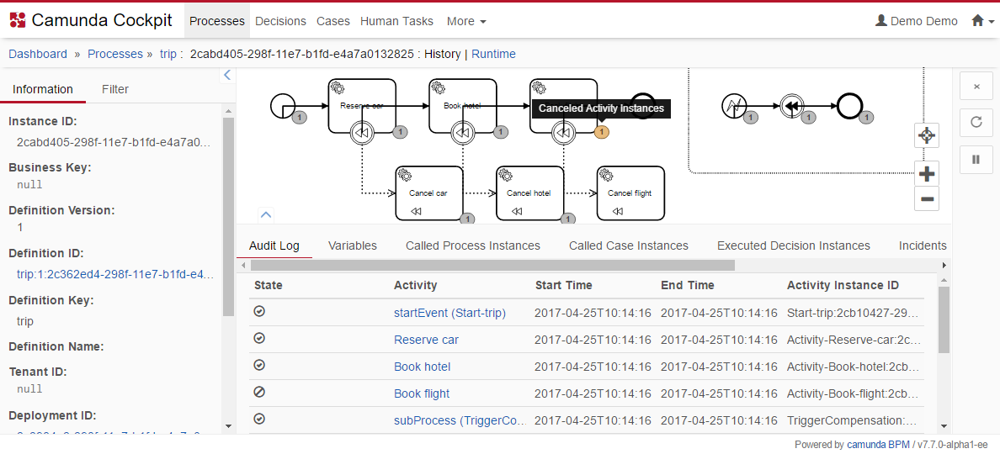
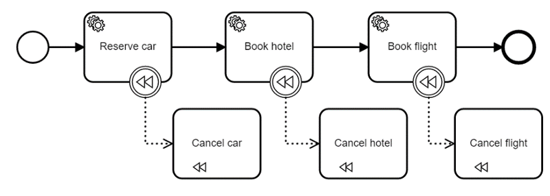

# Saga example: trip booking

The Saga pattern describes how to solve distributed (business) transactions without two-phase-commit as this does not scale in distributed systems. The basic idea is to break the overall transaction into multiple steps or activities. Only the steps internally can be performed in atomic transactions but the overall consistency is taken care of by the Saga. The Saga has the responsibility to either get the overall business transaction completed or to leave the system in a known termination state. So in case of errors a business rollback procedure is applied which occurs by calling compensation steps or activities in reverse order. A more detailed look on Sagas is available in [Saga: How to implement complex business transactions without two phase commit](
https://blog.bernd-ruecker.com/saga-how-to-implement-complex-business-transactions-without-two-phase-commit-e00aa41a1b1b)

In the example hotel, car and flight booking might be done by different remote services. So there is not technical transaction, but a business transaction. When the flight booking cannot be carried out succesfully you need to cancel hotel and car. 



Using [Camunda](https://camunda.org/) you can implement the Saga either by using graphical modeling or by a Java DSL, called Model-API. As Camunda is very lightweight you can start the so called process engine, define the Saga and run instances by a couple of lines of Java code (if you use the default configuration and an in-memory H2 database), see [TripBookingSaga.java](src/main/java/io/flowing/trip/saga/camunda/simple/TripBookingSaga.java):

```java
public class TripBookingSaga {

  public static void main(String[] args) {
    // Configure and startup (in memory) engine
    ProcessEngine camunda = 
        new StandaloneInMemProcessEngineConfiguration()
          .buildProcessEngine();
    
    // define saga as BPMN process
    ProcessBuilder saga = Bpmn.createExecutableProcess("trip");
    
    // - flow of activities and compensating actions
    saga.startEvent()
        .serviceTask("car").name("Reserve car").camundaClass(ReserveCarAdapter.class)
          .boundaryEvent().compensateEventDefinition().compensateEventDefinitionDone()
          .compensationStart().serviceTask("car-compensate").name("Cancel car").camundaClass(CancelCarAdapter.class).compensationDone()
        .serviceTask("hotel").name("Book hotel").camundaClass(BookHotelAdapter.class)
          .boundaryEvent().compensateEventDefinition().compensateEventDefinitionDone()
          .compensationStart().serviceTask("hotel-compensate").name("Hotel car").camundaClass(CancelCarAdapter.class).compensationDone()
        .serviceTask("flight").name("Book flight").camundaClass(BookFlightAdapter.class)
          .boundaryEvent().compensateEventDefinition().compensateEventDefinitionDone()
          .compensationStart().serviceTask("flight-compensate").name("Cancel flight").camundaClass(CancelCarAdapter.class).compensationDone()
        .endEvent();
    
    // - trigger compensation in case of any exception (other triggers are possible)
    saga.eventSubProcess()
        .startEvent().error("java.lang.Throwable")
        .intermediateThrowEvent().compensateEventDefinition().compensateEventDefinitionDone()
        .endEvent();     

    // finish Saga and deploy it to Camunda
    camunda.getRepositoryService().createDeployment() //
        .addModelInstance("trip.bpmn", saga.done()) //
        .deploy();
    
    // now we can start running instances of our saga - its state will be persisted
    camunda.getRuntimeService().startProcessInstanceByKey("trip", Variables.putValue("name", "trip1"));
    camunda.getRuntimeService().startProcessInstanceByKey("trip", Variables.putValue("name", "trip2"));
  }

}
```

The real logic is attached as Java code by the adapter classes, e.g. the [BookHotelAdapter](src/main/java/io/flowing/trip/saga/camunda/adapter/BookHotelAdapter.java).

The definition might look a bit verbose, as you have to use BPMN terminology. But you could write a thin [SagaBuilder](src/main/java/io/flowing/trip/saga/camunda/springboot/builder/SagaBuilder.java) that improves readability of the Saga definition:

```java
SagaBuilder saga = SagaBuilder.newSaga("trip")
        .activity("Reserve car", ReserveCarAdapter.class) 
        .compensationActivity("Cancel car", CancelCarAdapter.class) 
        .activity("Book hotel", BookHotelAdapter.class) 
        .compensationActivity("Cancel hotel", CancelHotelAdapter.class) 
        .activity("Book flight", BookFlightAdapter.class) 
        .compensationActivity("Cancel flight", CancelFlightAdapter.class) 
        .end()
        .triggerCompensationOnAnyError();

camunda.getRepositoryService().createDeployment() 
        .addModelInstance(saga.getModel()) 
        .deploy();
```

The engine will take care of state handling, compensation and could also handle timeouts and escalations.

In real-life scenarios you might configure and run the Camunda engine differently, e.g. by using Spring or Spring Boot. In this example you can also use the [Spring Boot Application](src/main/java/io/flowing/trip/saga/camunda/springboot/Application.java) in order to fire the application up - and afterwords even connect Camundas visual tooling.

A visual representation is automatically created in the background by Camunda. (**You need to use Camunda in a version >= 7.8.0.**)



The flow can also be modeled graphically instead of using the Model API. In this case use the [Camunda Modeler](https://camunda.org/download/modeler/) to draw the BPMN notation:



The [trip.bpmn (BPMN model file)](docs/trip.bpmn)


# Get started

You need

* Java
* Maven

Required steps

* Checkout or download this project
* Run the [Application.java](src/main/java/io/flowing/trip/saga/camunda/springboot/Application.java) class as this is a Spring Boot application running everything at once, starting exactly one Saga that is always "crashing" in the flight booking
* If you like you can access the Camunda database from the outside, e.g. using the ["Camunda Standalone Webapp"](https://camunda.org/download/) to inspect state. Use the follwing connection url: ```jdbc:h2:tcp://localhost:8092/mem:camunda;DB_CLOSE_DELAY=-1;DB_CLOSE_ON_EXIT=FALSE```. Note that you need [Camunda Enterprise](https://camunda.com/trial/) to see historical data.

As an alternative:
* Run the [TripBookingSaga.java](src/main/java/io/flowing/trip/saga/camunda/simple/TripBookingSaga.java) class via your favorite IDE - it also will run instances of the Saga without requiring any infrastructure

